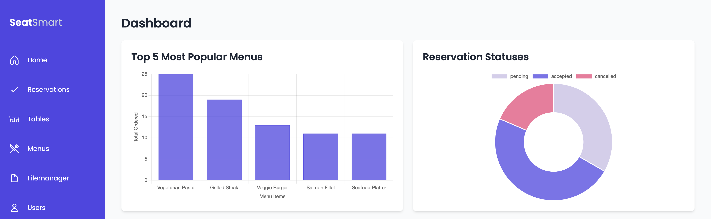

# SeatSmart Backoffice

## Student Information
- **Name:** Bénoît Biraguma Ihimbazwe
- **Group:** PGM2
- **Course:** Data Management
- **Lector:** De Weirdt Dieter

## Application Description
SeatSmart is a custom backoffice application designed for managing restaurant reservations efficiently. This application allows restaurant staff to add, edit, delete, and view reservations in a streamlined manner. The backoffice is built using PHP and MySQL, adhering to MVC architectural patterns.

## Features
- **Dashboard:** Showcases two key statistics using Chart.js:
  - Top 5 most popular menus
  - Reservations statuses
- **CRUD Operations:**
  - Reservations: Users can view, create, edit, and delete reservations.
  - Menus: Users can manage the restaurant's menu items with full CRUD capabilities.
  - Tables: Users can manage the restaurant's tables with full CRUD capabilities.
- **File Uploads:** Ability to upload files such as images for menu items.
- **Relationship Management:** Implements one-to-many relationships via dropdown menus (e.g., assigning users to reservations).
- **File Manager:** A file manager to view and manage uploaded files (company assets, images for menu items).
- **Filters and Sorting:** Enhanced filter capabilities for reservations and search capabilities for menus.
- **Security:** SQL injection prevention mechanisms are implemented to secure data integrity.

## Public API
- **Endpoints:**
  - GET `/api/reservations`: Retrieves all reservations with options to filter by date, user, or status.
    - API Usage: Here are the optional query parameters: user_id, date, and status. Their expected values for API consumers are the following:
      - user_id is an integer: 1, 2, 3, or 4 (there are only 4 users in the given database)
      - date is a date for example: 2024-11-10
      - status is an enum and has three psossibilities: 'accepted', 'pending' or 'cancelled'
    - Example: the following get request would give me the reservations made by the Admin, that take place on the 2024-11-10 and have the status accepted.
      - https://127.0.0.1:7001/api/reservations/?user_id=1&reservation_date=2024-11-10&status=accepted
  - GET `/api/reservations/(\d+)`: Retrieves a reservation by id.
  - POST `/api/reservations/(\d+)/comment`: Adds or updates a comment on a specific reservation.

## Database Model
- **File:** `./databasemodel.pdf`
- The database includes six main tables, designed following Laravel naming conventions.

## Database SQL File
- **File:** `./database.sql`
- This SQL file contains the schema and data for setting up the SeatSmart database.

## Installation tips
- Don't forget to install composer `ddev composer install`
- Import `database.sql` to your MySQL database
- Don't forget to install npm and run `npm run build` for Tailwind
- If the `config.php` is unchanged the project should run on `https://127.0.0.1:7001` (if it was still available).

## Screencast Overview (not included in repo)
- **File:** `./screencast.mp4`
- A brief video demonstration that walks through the functionality of the SeatSmart application, showcasing the user interface and the features implemented.